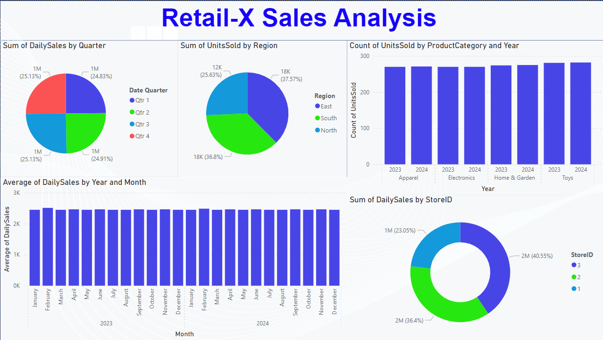

# RetailX Sales Analysis Project

## Overview
This project is a comprehensive analysis of sales data from RetailX, a fictional retail company. The analysis was conducted using Jupyter Notebook and Power BI as part of a data analysis journey. The project aimed to gain insights into sales performance, customer behavior, and trends to inform strategic decision-making within the company.

## Key Features
- **Data Exploration:** The dataset was explored to understand its structure, identify missing values, and gain initial insights into the sales data.
- **Data Cleaning:** Preprocessing steps were undertaken to clean the data, including handling missing values, removing duplicates, and ensuring data consistency.
- **Descriptive Analysis:** Various descriptive statistics and visualizations were created to summarize the sales data, including total revenue, top-selling products, and sales trends over time.
- **Customer Segmentation:** Utilizing techniques such as RFM (Recency, Frequency, Monetary) analysis, customers were segmented based on their purchasing behavior to identify high-value customers and target marketing strategies accordingly.
- **Predictive Modeling:** Machine learning techniques were applied to predict future sales trends and customer behavior, aiding in forecasting and resource allocation.
- **Dashboard Creation:** Interactive dashboards were developed using Power BI to visualize key insights and facilitate easy exploration of the data by stakeholders.

## Technologies Used
- Jupyter Notebook
- Python (Pandas, NumPy, Matplotlib, Seaborn)
- Power BI

## Project Structure
- **Notebooks:** Contains Jupyter Notebooks detailing the analysis process, from data preprocessing to visualization and modeling.
- **Data:** Includes the raw dataset and any processed data used in the analysis.
- **Visualizations:** Contains visualizations generated during the analysis, including charts, graphs, and dashboards.
- **Documentation:** Any additional documentation related to the project, such as project requirements, methodology, and findings.

## DashBoard

